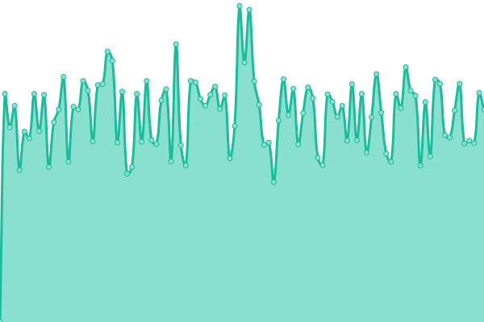
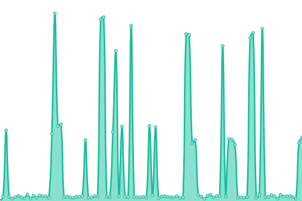
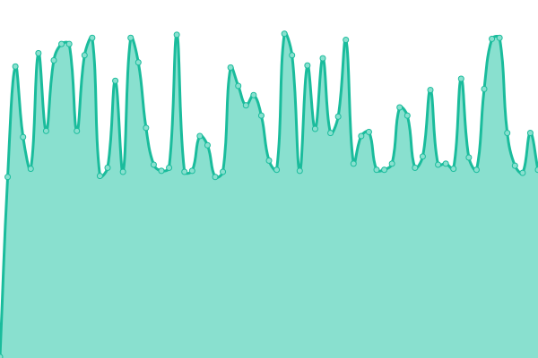

# [Astradial Status](https://status.astradial.com)

This repository contains the uptime monitor and status page for [Astradial](https://astradial.com), powered by [Upptime](https://github.com/upptime/upptime).

<!--start: status pages-->
<!-- This summary is generated by Upptime (https://github.com/upptime/upptime) -->
<!-- Do not edit this manually, your changes will be overwritten -->
<!-- prettier-ignore -->
| URL | Status | History | Response Time | Uptime |
| --- | ------ | ------- | ------------- | ------ |
|  [Cloud PBX API](https://devpbx.astradial.com/docs) | 🟩 Up | [cloud-pbx-api.yml](https://github.com/astradial/upptime/commits/HEAD/history/cloud-pbx-api.yml) | 

 954ms
     
 | 

<a href="https://status.astradial.com/history/cloud-pbx-api">100.00%</a>
    

|  [Lite](https://lite.astradial.com/health) | 🟩 Up | [lite.yml](https://github.com/astradial/upptime/commits/HEAD/history/lite.yml) | 

 432ms
     
 | 

<a href="https://status.astradial.com/history/lite">100.00%</a>
    

|  [Voice](https://voice.astradial.com/health) | 🟩 Up | [voice.yml](https://github.com/astradial/upptime/commits/HEAD/history/voice.yml) | 

 748ms
     
 | 

<a href="https://status.astradial.com/history/voice">100.00%</a>
    

|  [Events](https://events.astradial.com/) | 🟩 Up | [events.yml](https://github.com/astradial/upptime/commits/HEAD/history/events.yml) | 

 1137ms
     
 | 

<a href="https://status.astradial.com/history/events">100.00%</a>
    

|  [NUC Gateway (via Cloud)](http://89.116.31.109:19999/api/v1/info) | 🟥 Down | [nuc-gateway-via-cloud.yml](https://github.com/astradial/upptime/commits/HEAD/history/nuc-gateway-via-cloud.yml) | 

 228ms
     
 | 

<a href="https://status.astradial.com/history/nuc-gateway-via-cloud">100.00%</a>
    

<!--end: status pages-->

## Services Monitored

- **Cloud PBX API** — devpbx.astradial.com
- **Lite** — lite.astradial.com
- **Voice** — voice.astradial.com
- **Events** — events.astradial.com
- **NUC Gateway** — SIP gateway health via Netdata

## License

- Powered by: [Upptime](https://github.com/upptime/upptime)
- Code: [MIT](./LICENSE)
